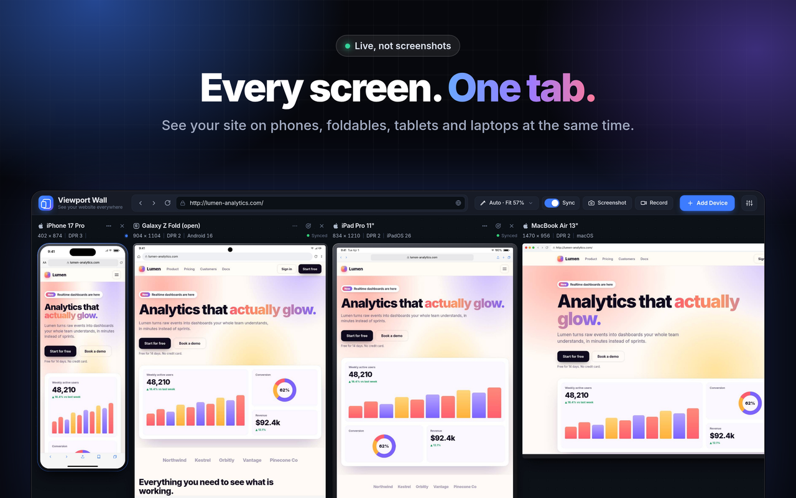
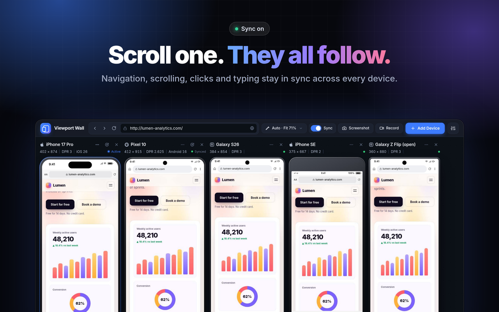
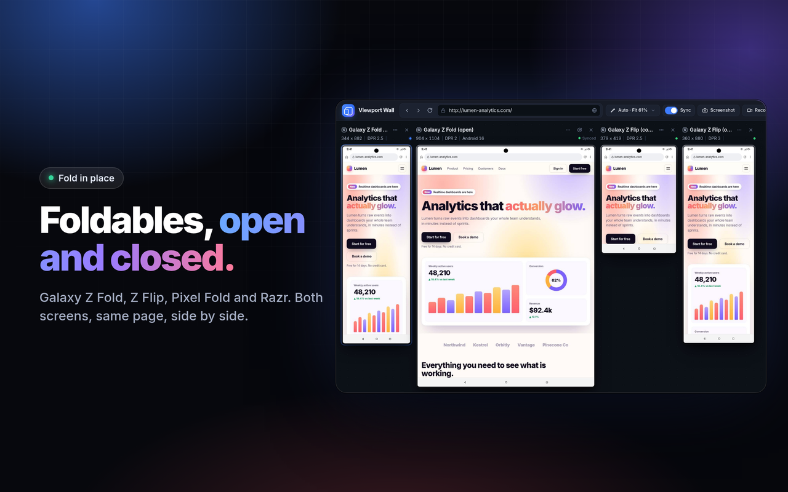

# Viewport Wall

Chrome extension: see one website on many viewports at once, with synchronized navigation and scroll.



## Two halves

| | For | Install |
| --- | --- | --- |
| **Viewport Wall** (this extension) | A person looking at devices | [Chrome Web Store](https://chromewebstore.google.com/detail/viewport-wall/famamjgffefkajiifeigbfgmmbgnkdmn) |
| **viewport-wall-mcp** ([mcp/](mcp/)) | An AI agent checking pages | one line of MCP config, see below |

Both read the same device library, so the agent tests exactly what you see.

## Install

**[Add to Chrome from the Chrome Web Store](https://chromewebstore.google.com/detail/viewport-wall/famamjgffefkajiifeigbfgmmbgnkdmn)**

### From source (unpacked)

1. `chrome://extensions` → enable **Developer mode** → **Load unpacked** → select this folder.
2. Open any page (or `localhost:3000`) and click the toolbar icon. The wall opens with that URL; clicking the icon again reuses the open wall and sends it the new page.

## How it works

- Two rendering modes, chosen per device (Settings → Rendering):
  - **Full emulation** (default for every remote site): a real Chrome tab in the wall's own window (collapsed "Viewport Wall" tab group), controlled with the `chrome.debugger` API. No extra windows are opened.
  - **Interactive** (Auto picks it for `localhost` / `127.0.0.1` / `*.localhost` when the server sends no `X-Frame-Options` or restrictive `frame-ancestors`): the page runs in a live `<iframe>` inside the wall. Real-time and directly interactive, no capture pipeline, but only width/height emulation (no DPR, touch or user-agent) and no screenshots. The wall's host permission for localhost lets the agent script run inside these frames for scroll/navigation sync and issue checks, and gives them access to the site's normal cookies (Chrome's storage-partitioning exemption for extension pages with host permission). Sites that block framing fall back to Full emulation automatically.
  `Emulation.setDeviceMetricsOverride` applies width/height/DPR/mobile/touch/user-agent, so CSS media queries see the real emulated viewport.
  This works on sites that block iframes (`X-Frame-Options`, `frame-ancestors`) and on localhost/staging with your existing cookies.
- Full-emulation devices show a live stream: `Page.startScreencast` runs on every tab at the resolution the panel is displayed at (JPEG, `maxWidth`/`maxHeight` = panel size), so a phone shown at 40% costs a fraction of a full frame. Chrome pushes a frame only when the compositor produced one, which is the "pixels changed" signal: a still page sends nothing, a scrolling one streams at the compositor's full rate for the active device and 20/15 fps for the others (`everyNthFrame`). An inactive device that keeps streaming for 3 s (an animation) drops to 10 fps until it is touched or navigates. The screencast also keeps hidden tabs painting. `Page.captureScreenshot` (clipped to the visual viewport in document coordinates) is only a fallback for the first paint and for a device whose agent reported a change without a frame following, plus full-resolution downloads.
- A device that already shows a page keeps it until the next page paints: no spinner, and no white flash from the new document. Frames are held back while they are still blank (a JPEG of a blank page costs a fraction of a byte per pixel), until the page paints content or a 5 s hold expires.
- Stream frames and fallback captures are produced at exactly the same pixel size (`captureScreenshot`'s `clip.scale` multiplies the emulated DPR, `startScreencast`'s `maxWidth` does not), and every frame is decoded before it is swapped into the panel. Otherwise panels visibly pulse between two resolutions while scrolling.
- Click a panel to make it active. Mouse, wheel, and keyboard on the active panel are forwarded via `Input.*`.
- Navigation sync propagates full loads and SPA route changes (pushState/replaceState/popstate/hashchange).
- Scroll sync uses percentage position (`scrollTop / (scrollHeight - viewportHeight)`).
- Everything is local: `chrome.storage.local` for custom devices, sets, preferences, and recent URLs. Nothing is uploaded.

Chrome shows an "is debugging this browser" bar while the wall is open; that is expected and cannot be removed by an extension. Closing the wall tab closes the device tabs.

## UI

One header bar: brand, pill URL bar with back/forward/reload, View menu (layout, zoom, frame style incl. none, browser UI, rotate all, presentation), Sync switch (on: navigation, scroll, clicks and typing in one device happen on every device; off: only the device you touch reacts), Screenshot menu, Record (WebM of the wall), Add Device, Settings (theme, mobile user agent, auto reload, QA report, about). Everything about adding devices lives in the Add Device modal: sets, simple tags (Phone, Fold, Tablet, PC, Watch, TV, Widths, Favorites, Custom), search, and every preset drawn with a tiny silhouette. Footer: a Devices hub (list, sets, save set, breakpoints, save session, sessions, clear all), performance. Compare two devices from a device's menu ("Compare with active"). Focus a device by double-clicking it or from its menu; Escape returns to the wall. "Pause live updates" in Settings freezes every device. Each device label has rotate, close and one actions menu (reload, rotate, fold/unfold on foldables, pause, focus, capture, compare, note, edit, duplicate, network, CPU, remove); double-click a device to focus it. Inter font bundled locally; dark and light themes.

Realistic frames are data-driven (`frames.js`): iPhone modern (Dynamic Island, iOS status bar, Safari bar, home indicator), iPhone classic (bezels + home button), Pixel / Galaxy (punch-hole, Android status bar, Chrome bar, gesture bar), iPad, desktop browser window, and a minimal rounded frame for raw breakpoints. All bars sit outside the emulated viewport, so CSS media queries always see the exact device width.

## Features





- Wall: auto grid, horizontal, vertical, focus + comparisons; fit or fixed zoom; frames toggle; presentation mode; drag to reorder; double-click to focus one device.
- Devices: 37 named presets + raw breakpoints, custom devices, favorites, saved sets, duplicate, rotate (one/all), pause, drag the right edge of a panel to resize its width live.
- Sync is always on: navigation (full loads + SPA routes), scroll (percentage), clicks (matched by id > data-testid > href > aria-label > text), input (mirrors typed text into the matching field).
- Breakpoints: detect min/max-width media queries in the page's stylesheets, add them all, or add width-1 / width / width+1 boundary tests.
- Checks (per device, automatic): horizontal overflow, clipped text in buttons/headings/links, fixed elements exceeding the viewport, images exceeding the viewport. Issues appear on the panel badge and in the issues bar.
- Device library: iPhones, Pixels, Galaxies, Xiaomi, OnePlus, foldables and flip phones (Z Fold / Z Flip / Razr, open and cover screens), iPads, Galaxy Tab, Pixel Tablet, Surface Pro, MacBooks, iMac, Surface Laptop, Windows laptops, 1080p / 1440p / 4K / ultrawide desktops, kiosk portrait, Apple Watch, Pixel Watch, Galaxy Watch, TVs (1080p, 4K, Apple TV, Google TV, Samsung), plus raw breakpoints and custom sizes. Sets: Popular Mobile, Apple, Android, Tablets, Desktops, Foldables, Watches + TV, All Screens, Essential, Mobile + Tablet, Breakpoints, Stress Test.
- QA: per-device notes, Markdown report to clipboard, saved sessions (URL, devices, layout, notes).
- Screenshots: one device, full page, every device, whole wall with metadata footer (Screenshot menu or the device menu).
- Reload: all, one, hard (Shift+click), auto reload interval.
- Panel menu (⋯): per-device zoom (also Ctrl+wheel), network profile (Fast 4G / Slow 4G / 3G / Offline), CPU slowdown, add to compare (two devices → side-by-side image), edit device.
- Checks also flag overlapping interactive elements (nav/header/buttons/links/headings/images).

## Performance (measured)

Headless Chromium 151 on a 24-core Linux box, `bench2.py` in the test harness. CPU is the sum over all Chrome processes (100% = one core); RSS is the whole browser including the wall page. "Static" is a plain page, "animated" is a worst case that rewrites text at 60 fps in every device.

| Devices | Mode | Idle CPU static / animated | Scrolling CPU static / animated | RSS static / animated | Frames sent, animated | All devices ready after navigation |
|---|---|---|---|---|---|---|
| 1 | Full emulation | 0% / 70% | 11% / 66% | 1.08 / 1.42 GB | 60 fps | 0.3 s |
| 4 | Full emulation | 2% / 193% | 30% / 149% | 1.52 / 2.11 GB | 90 fps total | 0.3 s |
| 8 | Full emulation | 1% / 240% | 105% / 241% | 2.07 / 2.67 GB | 98 fps total | 0.3 s |
| 12 | Full emulation | 1% / 247% | 112% / 254% | 2.59 / 3.21 GB | 118 fps total | 0.3 s |
| 4 | Interactive (iframe) | 0% / 20% | 14% / 24% | 1.11 / 1.14 GB | native | 0.3 s |
| 12 | Interactive (iframe) | 1% / 30% | 21% / 35% | 1.16 / 1.21 GB | native | 0.3 s |

What this says: a still wall costs nothing in either mode (no frames are sent). Scrolling on the active device streams real frames to every panel, so a 12-device scroll costs about one core. Each emulated tab costs roughly 130 MB and, on a page that animates continuously, most of the cost is the renderers themselves (about 20% of a core each), so an animated 12-device wall is heavy; the Snapshots pause in Settings or Interactive mode for local work brings it down. Real sites (YouTube watch page, react.dev, nextjs.org, github.com, threejs.org, MDN, Wikipedia) render and scroll in sync on four devices in the `sites.py` check.

## Connect an AI agent

`mcp/` is a companion package that gives an agent the same devices: it loads a page at every viewport, reports
what breaks with the element that caused it, finds the real breakpoints, and returns screenshots on request.
It drives the Chrome already on the machine, so there is no server, no browser download and no API key.

```json
{ "mcpServers": { "viewport-wall": { "command": "npx", "args": ["-y", "viewport-wall-mcp"] } } }
```

In the extension: Settings → **Connect your AI agent** copies that block, or the `claude mcp add` command.
Details and the CLI form are in [mcp/README.md](mcp/README.md).

## Shortcuts

`A` add device · `R` reload all · `Shift+R` rotate all · `F` presentation · `1–9` activate device · `+/-` zoom · `Esc` exit · double-click a panel to focus it.

## Layout

```
manifest.json   MV3 manifest (debugger, tabs, storage, activeTab)
background.js   opens the wall from the toolbar icon; closes the device tab group when the wall tab closes
agent.js        in-page agent: scroll/navigation reports, responsive checks (CDP-injected or content script)
core.js         target manager, rendering modes, CDP emulation, screencast stream + capture fallback, sync, screenshots, sessions (no DOM)
wall.js         UI: toolbars, menus, canvas layout, picker, focus/compare/presentation
wall.html/css   structure + design tokens (dark/light)
frames.js       data-driven device shells, status bars, browser bars, cutouts
icons.js        inline SVG icon set
devices.js      device library + built-in sets (data only; add a device = add a line)
```
